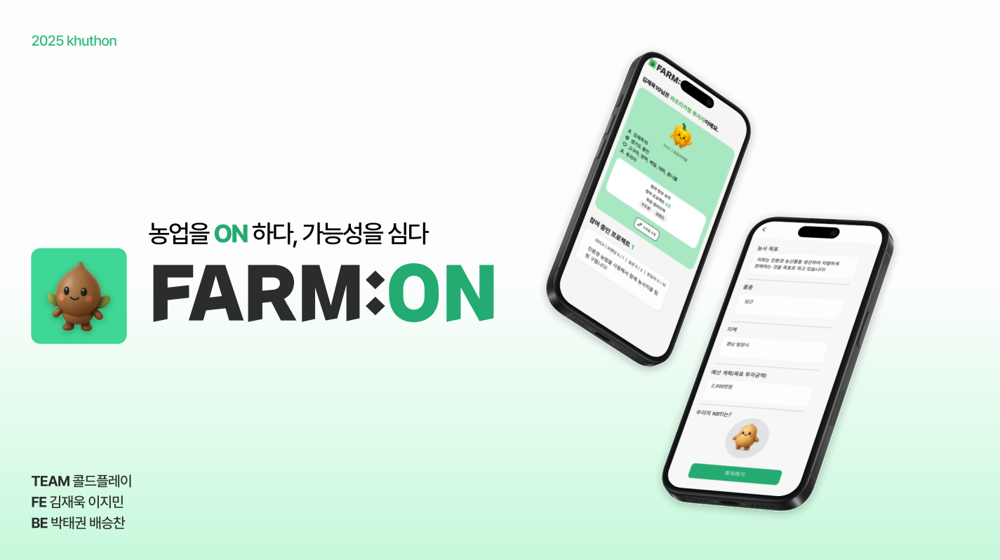
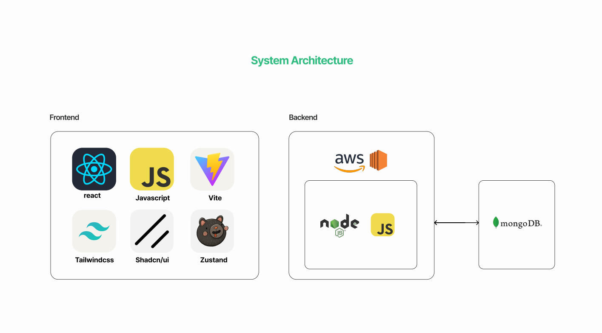

# 🌱FARM:ON - "농업을 ON하다, 가능성을 심다."
 (2025 쿠톤(KHUThon) Coldplay 팀 - Backend)

- Backend Github: https://github.com/scbae18/25_khuthon_coldplay_BE/tree/dev
- Frontend Github: https://github.com/jaewook2400/2025_coldplay_fe/tree/feature/jmlee

### 🏆2025년 KHUThon 대상, 인기상 수상🏆

---

## 👀 Overview
FARM:ON(팜온)은 각자의 농업 성향(NBTI)에 맞춰 직접 농사를 짓거나, 브랜딩, 노동, 펀딩, 투자 등 다양한 방식으로 프로젝트에 참여할 수 있는 참여형 농업 펀딩 플랫폼이에요.

## 🔧 주요 기능
1. 농BTI 검사하기
- 농업과 관련된 자신의 성향을 알아볼 수 있어요.
2. 농사 펀딩 시작하기
- 함께할 팀을 모집해요
- 팀원이 참가해요
- 프로젝트 계획서를 작성해요
- 등록하고 투자자를 모집해요.

## ⚙️ 기술 스택

### 프론트엔드 (Frontend)
- React.js – 사용자 인터페이스 구현
- Figma – 와이어프레임 및 UI 디자인 참고
### 백엔드 (Backend)
1. Node.js + Express.js – 서버 및 API 구현
2. MongoDB (with Mongoose) – NoSQL 데이터베이스
### 배포 및 협업
1. Git / GitHub – 형상관리 및 협업
2. EC2 (AWS) – 서버 배포 및 운영
3. MongoDB Atlas – 클라우드 DB 서비스
4. PM2 – Node.js 앱 프로세스 관리
---
## API
## ✨ Auth - 인증

| Method | Endpoint         | Description          |
| ------ | ---------------- | -------------------- |
| POST   | `/auth/register` | 회원가입 (이메일, 비밀번호, 이름) |
| POST   | `/auth/login`    | 로그인                  |
| GET    | `/auth/me`       | 가입자 정보 + NBTI 결과 조회  |

---

## 🌱 NBTI - 농비티아이이

| Method | Endpoint          | Description         |
| ------ | ----------------- | ------------------- |
| GET    | `/nbti/questions` | 질문 목록 조회            |
| POST   | `/nbti/info`      | 사용자 role + crops 저장 |
| POST   | `/nbti/submit`    | NBTI 응답 제출 및 결과 계산  |
| GET    | `/nbti/result`    | 복사가능한 NBTI 결과 보기    |

---

## 💼 Projects - 프로젝트 구성

| Method | Endpoint             | Description                  |
| ------ | -------------------- | ---------------------------- |
| POST   | `/projects`          | 프로젝트 생성 (기본정보 + teamRecruit) |
| GET    | `/projects`          | 목록 조회                        |
| GET    | `/projects/:id`      | 상세 조회                        |
| PATCH  | `/projects/:id`      | 펀딩 금액 업데이트                   |
| PATCH  | `/projects/:id/join` | 프로젝트 참여 (역할 지정)              |

---

## 💸 Funds - 펀딩 가능 프로젝트

| Method | Endpoint    | Description    |
| ------ | ----------- | -------------- |
| GET    | `/fund`     | 가능 프로젝트 목록     |
| GET    | `/fund/:id` | 특정 프로젝트 계획서 조회 |

---

## 📅 Planners - 계획서 작성

| Method | Endpoint    | Description                       |
| ------ | ----------- | --------------------------------- |
| POST   | `/planners` | 계획서 생성 (goal, region, nbtiRef...) |

## 👨‍👩‍👧‍👦 팀원
Backend: 박태권, 배승찬

Frontend: 김재욱, 이지민